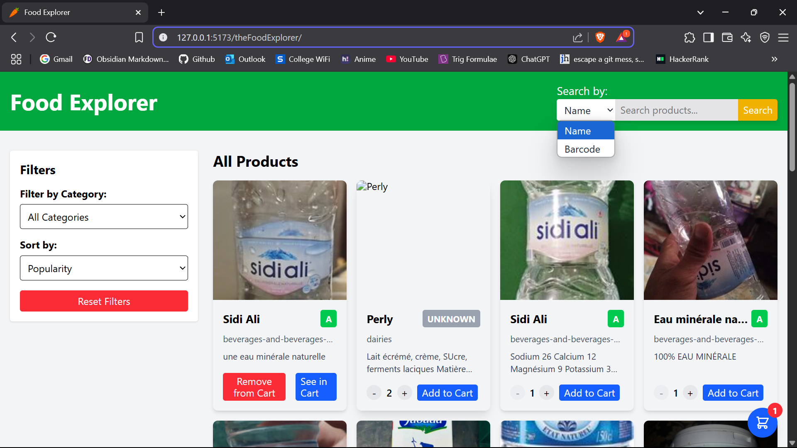

# 🍎 Food Product Explorer

A modern, responsive web application that allows users to search, filter, and explore detailed information about food products using the OpenFoodFacts API.



## ✨ Features

- 🔍 **Advanced Search**: Find products by name or barcode
- 🗂️ **Category Filtering**: Browse products by food categories
- 🔄 **Smart Sorting**: Order products by name or nutrition grade
- 📊 **Nutrition Information**: View detailed nutritional values
- 📱 **Responsive Design**: Works seamlessly on mobile and desktop
- ♾️ **Infinite Scroll**: Load more products as you browse
- 🔍 **Detailed Product View**: See ingredients, nutrition, and more
- 🛒 **Shopping Cart**: Collect interesting products with quantity management

## ⌚ Time taken to build:
This project was completed in under 12 hours. Admittedly a lot of help was taken from [docs](#Acknowledgements) [blog posts](https://dev.to/clarenceg01/building-a-shopping-cart-using-react-redux-toolkit-1fd5), [youtube tutorials](https://youtu.be/NJ1inoC1L1k?si=VTR6J5oRkbjpd08D) and [claude](https://claude.ai).

## 🛠️ Technology Stack

- **Frontend**: React with Vite
- **State Management**: Redux Toolkit
- **Styling**: Tailwind CSS
- **Routing**: React Router
- **API**: OpenFoodFacts API
- **HTTP Requests**: Fetch API

## 🚀 Getting Started

### Prerequisites

- Node.js (v14.0.0 or later)
- npm or yarn

### Installation

1. Clone the repository
   ```bash
   git clone https://github.com/yourusername/food-product-explorer.git
   cd food-product-explorer
   ```

2. Install dependencies
   ```bash
   npm install
   # or
   yarn
   ```

3. Start the development server
   ```bash
   npm run dev
   # or
   yarn dev
   ```

4. Open your browser and navigate to `http://localhost:5173`

## 🧠 Lessons Learned

Two things I got my hands on through this project only, I had to research and learn about them through a lot of web surfing:

- **API Integration**: Working with real-world APIs often requires handling inconsistent or missing data
- **Global State Management**: Properly structured Redux state management implementation

some other best practices I got my hands on during this:

- **Performance**: Infinite scrolling requires careful implementation to avoid performance issues
- **User Experience**: Clear loading states and error handling significantly improve usability
- **Persistent Storage**: Using localStorage to maintain cart state between sessions

## 🏗️ Project Structure

```
src/
├── app/
│   └── store.js             # Redux store configuration
├── components/              # Reusable UI components
│   ├── AddToCartButton.jsx  # Cart interaction component
│   ├── CartButton.jsx       # Floating cart access button
│   ├── CategoryFilter.jsx   # Category filtering component
│   ├── Header.jsx           # App header with navigation
│   ├── ProductCard.jsx      # Card to display product preview
│   ├── ProductList.jsx      # Container for product cards
│   ├── Search.jsx           # Search functionality
│   └── Sort.jsx             # Sorting options component
├── features/                # Feature-based organization
│   ├── products/
│   │   ├── productsSlice.js # Redux slice for products
│   │   ├── ProductsPage.jsx # Main product listing page
│   │   └── ProductDetail.jsx # Detailed product view
│   └── cart/
│       ├── cartSlice.js     # Redux slice for cart management
│       └── CartPage.jsx     # Cart page with quantity controls
├── hooks/                   # Custom React hooks
│   └── useInfiniteScroll.js # Hook for infinite scrolling
├── App.jsx                  # Main app component with routing
└── main.jsx                 # Application entry point
```

## 🔄 State Management

The application uses Redux Toolkit for state management with two main slices:

### Products Slice (`productsSlice.js`)
Handles:
- Product listing data
- Search queries
- Filtering options
- Sorting preferences
- Pagination state
- Loading states
- API request status

### Cart Slice (`cartSlice.js`)
Handles:
- Cart items collection
- Item quantities
- Total items count
- Add/remove operations
- Quantity adjustments
- Cart persistence with localStorage

### Key State Elements

```javascript
{
  products: {
    items: [],              // Array of product objects
    count: 0,               // Total number of products available
    page: 1,                // Current page for pagination
    status: 'idle',         // API request status: 'idle' | 'loading' | 'succeeded' | 'failed'
    error: null,            // Error message if request fails
    searchQuery: '',        // Current search term
    selectedCategory: '',   // Selected category for filtering
    sortOption: 'popularity' // Current sort option
  },
  cart: {
    items: [],              // Array of cart items with quantities
    totalItems: 0           // Total number of items in cart
  }
}
```

## 🌐 API Integration

This application integrates with the OpenFoodFacts API, a free and open database of food products from around the world.

### Main Endpoints Used

I think the toughest part of the project for me was to clearly understand and get used to the Open Food Facts api.

- **Search Products**: `https://world.openfoodfacts.org/cgi/search.pl?search_terms={query}&json=true`
- **Get Product by Barcode**: `https://world.openfoodfacts.org/api/v0/product/{barcode}.json`
- **Get Categories**: `https://world.openfoodfacts.org/categories.json`

### Example API Response (simplified)

```json
{
  "count": 1000,
  "page": 1,
  "page_size": 24,
  "products": [
    {
      "code": "3017620422003",
      "product_name": "Nutella",
      "categories_tags": ["en:breakfast-spreads", "en:chocolate-spreads"],
      "image_url": "https://images.openfoodfacts.org/...",
      "ingredients_text": "Sugar, palm oil, hazelnuts 13%...",
      "nutrition_grade_fr": "e",
      "nutriments": {
        "energy": 2252,
        "fat": 30.9,
        "carbohydrates": 57.5,
        "proteins": 6.3
      }
    },
    // More products...
  ]
}
```

## 📋 Core Features Implementation

### Search Functionality

The search component allows users to find products by name or barcode:

```jsx
function Search() {
  const [input, setInput] = useState('');
  const [searchType, setSearchType] = useState('name');
  const dispatch = useDispatch();

  const handleSubmit = (e) => {
    e.preventDefault();
    if (!input.trim()) return;
    
    if (searchType === 'name') {
      dispatch(setSearchQuery(input));
      dispatch(fetchProducts({ query: input, page: 1 }));
    } else {
      dispatch(fetchProductByBarcode(input));
    }
  };

  // Component render...
}
```

### Cart Functionality

The application includes a comprehensive cart system that allows users to:

```jsx
// AddToCartButton.jsx
function AddToCartButton({ product, size = "normal", showSeeInCart = true }) {
  const dispatch = useDispatch();
  const cartItem = useSelector(selectItemInCart(product.code));
  const [quantity, setQuantity] = useState(1);
  
  const handleAddToCart = () => {
    dispatch(addToCart({ product, quantity }));
    setQuantity(1);
  };
  
  // For products already in cart, show remove and 'see in cart' options
  return (
    <div>
      {cartItem ? (
        <div>
          <button onClick={handleRemoveFromCart}>
            Remove from Cart
          </button>
          
          {showSeeInCart && (
            <Link to="/cart">
              See in Cart
            </Link>
          )}
        </div>
      ) : (
        <div>
          {/* Quantity controls and Add button */}
        </div>
      )}
    </div>
  );
}
```

### Infinite Scroll

The application implements infinite scrolling to load more products as the user scrolls down:

```javascript
// useInfiniteScroll.js hook
function useInfiniteScroll(loadMore, isLoading) {
  const observer = useRef();
  
  const lastElementRef = useCallback(node => {
    if (isLoading) return;
    if (observer.current) observer.current.disconnect();
    
    observer.current = new IntersectionObserver(entries => {
      if (entries[0].isIntersecting) {
        loadMore();
      }
    });
    
    if (node) observer.current.observe(node);
  }, [loadMore, isLoading]);
  
  // Hook cleanup and return...
}
```

This hook is used in the ProductList component to detect when the user has scrolled to the last item and load more products.

### Product Detail View

When a user clicks on a product, they are taken to a detailed view that displays:

- Product image
- Name and brand
- Nutrition grade with visual indicator
- Ingredients list
- Nutritional values
- Labels (vegan, gluten-free, etc.)
- Add to Cart functionality with quantity control

## 🎨 Styling and UI

The application uses Tailwind CSS for styling, providing a clean, modern interface that is fully responsive. Key UI components include:

- **Product Cards**: Display essential product information in a grid layout
- **Nutrition Badges**: Color-coded indicators (A-E) for nutrition quality
- **Category Tags**: Visual representation of product categories
- **Loading States**: Clear indicators when content is loading
- **Responsive Grid**: Adapts to different screen sizes automatically
- **Floating Cart Button**: Always-accessible cart with item count
- **Quantity Controls**: Intuitive increment/decrement buttons for cart items

## 🧪 Testing

To test the application manually:

1. **Search Functionality**:
   - Search for common products like "chocolate"
   - Try searching by a barcode (e.g., "3017620422003" for Nutella)

2. **Filtering**:
   - Select different categories to filter products
   - Combine filters with search terms

3. **Sorting**:
   - Sort by product name (A-Z and Z-A)
   - Sort by nutrition grade (best and worst first)

4. **Infinite Scroll**:
   - Scroll down to trigger loading more products
   - Check that the loading indicator appears

5. **Product Details**:
   - Click on products to view detailed information
   - Verify that all product details load correctly

6. **Cart Functionality**:
   - Add products to cart with different quantities
   - Remove products from cart
   - Adjust quantities in the cart page
   - Verify cart persists between page refreshes

## 🚦 Performance Optimization

The application implements several performance optimizations:

- **Redux Selectors**: Efficient state access with memoized selectors
- **Debounced Search**: Prevents excessive API calls when typing
- **Lazy Loading**: Images are loaded as needed
- **Efficient Rendering**: React components only re-render when necessary
- **Pagination**: Data is fetched in manageable chunks
- **Cached Results**: Previous search results are preserved in state
- **LocalStorage**: Cart state persists between sessions without server calls

## 📱 Responsive Design

The application is fully responsive and works well on:

- **Mobile phones**: Single column layout with optimized touch targets
- **Tablets**: Two-column grid for products
- **Desktops**: Multi-column grid with sidebar filters
- **Large screens**: Optimized layout with maximum content width

## 🔧 Known Issues and Limitations

- The OpenFoodFacts API can be slow or unresponsive at times, I had to face a lot of issues with CORS error and 'ERR_CONNECTION_TIMED_OUT'.
- Some products may have incomplete data
- Category filtering is limited to the top categories due to API constraints, kept getting CORS error when trying to get the list of all categories.
- Image quality varies across products, and sometimes might not be available at all.

## 🔮 Future Improvements

Some ideas for future enhancements:

- **Favorites**: Allow users to save favorite products
- **Comparison**: Compare nutritional values between multiple products
- **Offline Support**: Implement service workers for offline capabilities
- **Advanced Filters**: Add filtering by allergens, ingredients, and nutrition values
- **Localization**: Support for multiple languages and regional product databases
- **Barcode Scanner**: Implement camera integration for scanning product barcodes

## Acknowledgements

- [OpenFoodFacts](https://world.openfoodfacts.org/) for providing the free API
- [Vite](https://vitejs.dev/) for the fast development environment
- [Redux Toolkit](https://redux-toolkit.js.org/) for simplified state management
- [Tailwind CSS](https://tailwindcss.com/) for the utility-first styling approach
- [React Router](https://reactrouter.com/) for client-side routing

---

Created with ❤️ by Madjob

*This project was developed as part of an assignment for selection to an internship and is not affiliated with OpenFoodFacts.*
